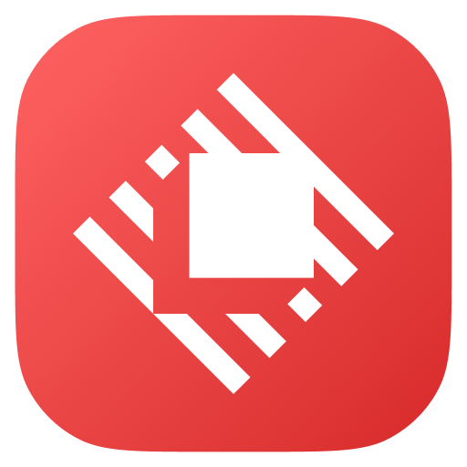

# 🚀 Smart LLM Translator for Raycast

**高精度なLLM翻訳機能を提供するRaycast拡張機能**

スマートな言語判定により、日本語・英語を自動的に適切な方向に翻訳します。Ollama、OpenAI、Claude、Geminiなど複数のLLMプロバイダーに対応。



## 🎯 特徴

### ✨ スマート翻訳機能
- **自動言語判定**: テキストを解析し、日本語→英語 / 英語→日本語を自動選択
- **高精度翻訳**: 専用システムプロンプトによる自然で流暢な翻訳
- **長文対応**: 短文から長文まで幅広いテキストサイズに対応

### 🔧 柔軟なLLM設定
- **マルチプロバイダー**: Ollama、OpenAI、Claude、Geminiなど複数対応
- **簡単設定**: UIからモデルの追加・削除・APIキー設定が可能
- **ローカル・クラウド**: ローカルLLM（Ollama）とクラウドAPI両方サポート

### 📊 詳細な結果表示
- **対比表示**: 原文と翻訳結果を並べて表示
- **メタ情報**: 使用モデル、処理時間、トークン使用量を表示
- **エラーサポート**: 詳細なエラー情報と対処方法を提示

## 🏗️ アーキテクチャ

### 設計思想
```
src/
├── types/          # 型定義（Domain Layer）
├── utils/          # 純粋なビジネスロジック（Domain Layer）
├── services/       # 外部API通信（Infrastructure Layer）
├── hooks/          # UI状態管理・ロジック（Application Layer）
└── components/     # UIコンポーネント（Presentation Layer）
```

## 🚀 クイックスタート

### 前提条件

#### Option A: Ollama（推奨・無料）
```bash
# Ollamaのインストール
brew install ollama

# Ollamaサーバー起動
ollama serve

# Qwen3モデルのダウンロード
ollama pull qwen3:8b
```

#### Option B: クラウドAPI
以下のいずれかのAPIキーを取得：
- **OpenAI API** (GPT-4, GPT-3.5-turbo)
- **Anthropic API** (Claude)
- **Google AI API** (Gemini)

### インストール・設定

1. **拡張機能を起動**
   ```
   Raycast → llmTranslate
   ```

2. **モデル設定**
   - 「モデル設定」を選択
   - 使用したいLLMプロバイダーを追加
   - APIキーを設定（クラウドAPI使用時）

3. **翻訳開始**
   - テキストを選択して「選択テキスト翻訳」
   - または「手動入力翻訳」でフォーム入力

## 📱 使用方法

### 1. 選択テキスト翻訳
```
1. システム上でテキストを選択
2. Raycast → llmTranslate → 選択テキスト翻訳
3. 自動で言語判定・翻訳実行
4. 結果をMarkdown形式で確認
```

### 2. 手動入力翻訳
```
1. Raycast → llmTranslate → 手動入力翻訳
2. フォームにテキストを入力
3. 送信ボタンで翻訳実行
4. 結果確認
```

### 3. モデル管理
```
1. Raycast → llmTranslate → モデル設定
2. 新しいモデルを追加
3. APIキーの設定
4. デフォルトモデルの変更
```

## 🔧 対応LLMプロバイダー

| プロバイダー | モデル例 | 設定方法 | 費用 |
|-------------|----------|----------|------|
| **Ollama** | qwen3:8b | ローカルインストール | 無料 |
| **OpenAI** | gpt-4o, gpt-3.5-turbo | APIキー設定 | 従量課金 |
| **Anthropic** | claude-3-sonnet | APIキー設定 | 従量課金 |
| **Google** | gemini-pro | APIキー設定 | 従量課金 |

### 推奨設定

#### 🏠 ローカル環境（無料）
```bash
# 高性能バランス型
ollama pull qwen2.5:7b

# 軽量高速型  
ollama pull phi3:mini
```

#### ☁️ クラウド環境（高精度）
- **GPT-4o**: 最高精度、やや高コスト
- **Claude-3-Sonnet**: 自然な翻訳、中コスト
- **Gemini-Pro**: 良好なバランス、低コスト

## 🛠️ 開発・カスタマイズ

### 開発環境セットアップ
```bash
# 依存関係インストール
npm install

# 開発モード起動
npm run dev

# ビルド
npm run build

# リント
npm run lint
```

### カスタムシステムプロンプト
翻訳の品質をカスタマイズしたい場合：

```typescript
// src/utils/textProcessing.ts
export function createEnToJaSystemPrompt(): string {
  return `あなたの専用翻訳指示をここに記述`;
}

export function createJaToEnSystemPrompt(): string {
  return `Your custom translation instructions here`;
}
```

### 新しい言語の追加
```typescript
// src/utils/textProcessing.ts
export function detectLanguage(text: string): Language {
  // 言語判定ロジックを拡張
}
```
